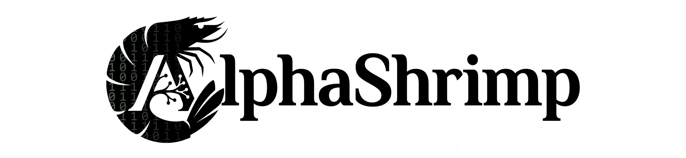

  

# 🦐 ALPHASHRIMP: Хватит плодить вкладки — стань Альфой управления ИИ

### 🌊 Твои нейронки разбросаны по всему океану закладок? Пора собрать их в одну стаю

**AlphaShrimp** — это не очередная «арена» для развлечений. Это твой личный мостик управления всеми топовыми LLM. Пока другие переключаются между аккаунтами и борются с интерфейсами, Альфа-креветка управляет всем роем из единого центра.

---

## 🧐 В чем прикол?

**AlphaShrimp** — это:

* **🍤 The Shrimp Swarm.** Доступ ко всем моделям в одном окне. Сравнивай ответы, комбинируй контексты.
* **📊 The Deep Log.** Твоя история запросов не пропадёт в бездне. Всё индексируется и хранится под твоим панцирем.
* **🦾 Smart Routing.** Система сама подскажет, какая модель сейчас «в форме» для твоей задачи, или отправит запрос сразу нескольким.
* **🌊 No-BS Interface.** Реактивный ⚡ blazingly fast ⚡ UI на Rust, который работает быстрее, чем захлопывается ловушка лангуста.

---

## ⚡ Киллер-фичи

* **🍤 The Shrimp Duel.** Тет-а-тет битва двух нейронок. Ты даешь задачу — они выдают результат. Кто выдал «базу» — тот Альфа. Кто галлюцинирует — тот креветка из почти просроченного морского коктейля, который ты любишь брать в Перекрёстке по скидке.
* **📊 The Boiling Pot.** Наш лидерборд обновляется быстрее, чем закипает вода. Смотри, кто сегодня доминирует в океане кода, а кто идет на дно в категории «Творчество».
* **🌊 Deep Sea Streaming.** Реактивно быстрый стриминг ответов. Никаких задержек, только чистый поток сознания.

---

## 🏗 Технологический Стек (Железобетонный Панцирь)

Мы построим AlphaShrimp на стеке (скорее всего на этом, но не обещаем), который выдержит давление Марианской впадины (проверять не будем):

* **[Leptos 0.8](https://leptos.dev/):** Изоморфный Rust для молниеносного фронтенда.
* **[Axum 0.8](https://github.com/tokio-rs/axum):** Мощный бэкенд-движитель.
* **[SQLx](https://github.com/launchbadge/sqlx):** Асинхронная работа с БД с проверкой типов на этапе компиляции.
* **[Tokio](https://tokio.rs/):** Сверхзвуковой рантайм для асинхронных операций.

---

## 🚢 Как спустить на воду?

[РАССКАЖЕМ ПОТОМ]

---

## 🚫 Закрытая Лагуна

Видишь эту мощь? Видишь этот код? Хочешь отправить Pull Request? **Придержи свои усики!** 🛑

Наша стая — это закрытая экосистема. Мы не принимаем вклад в проект со стороны. **Главная Креветка** установила жесткое правило: проект должен быть реализован исключительно силами нашей команды.

Ты можешь смотреть, можешь восхищаться, можешь пользоваться, но созидать это лангустиново творение будем только мы.

---

## 📜 Лицензия

MIT. Распространяй свободно, как морскую соль.

---
**AlphaShrimp — Докажи, что ты не планктон. Выбери свою Альфу.** 🦐👑
